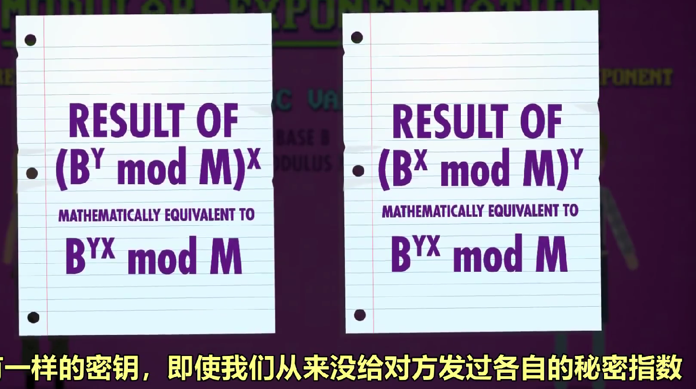

- 黑客与攻击
  background-color:: yellow
  id:: 6431facf-1e8a-4f70-b8ec-76169e39ee8e
	- 社会工程学：欺骗别人获取信息
	  card-last-score:: 1
	  card-repeats:: 1
	  card-next-schedule:: 2023-04-09T16:00:00.000Z
	  card-last-interval:: -1
	  card-ease-factor:: 2.5
	  card-last-reviewed:: 2023-04-09T02:41:16.288Z
	- 钓鱼Phishing：诈骗链接、假网站
	- 假托Pretexting：假扮公司内部人员骗你
	- 木马Trojan Horses：恶意软件
	- NAND镜像：物理插线来重置内存来攻破密码
	- 漏洞利用exploit：
		- 缓冲区溢出buffer overflow  解决方法：边界检查bounds checking
		- 代码注入code injection：用代码修改SQL数据库命令
	- 零日漏洞zero day vlnerability：开发者没发现新的漏洞
	- 计算机蠕虫worms：恶意程序在大量电脑间互相传播
	- 僵尸网络botnet：大量电脑被黑客拿下
	- 拒绝服务器攻击DDos：用来攻击服务器，发大量垃圾邮件堵塞网络
- 软件即服务（SaaS）是一种[云计算](https://www.redhat.com/zh/topics/cloud)形式，可通过网络浏览器为终端用户提供云应用及其所有的底层 IT 基础架构和平台。
	- 服务性能取决于互联网连接速度。SaaS 的示例包括一些应用服务提供商（ASP），如Microsoft Office 365。利用[多租户](https://www.redhat.com/zh/topics/cloud-computing/what-is-multitenancy)架构来隔离用户数据。SaaS 应用在很大程度上依赖于[订阅模式](https://www.redhat.com/zh/about/value-of-subscription)置备软件许可证。
	- 基础架构即服务（IaaS）和平台即服务（PaaS)
- 加密 密码学cryptography
	- 加密encryption:making text secret
	- 解密decryption:the reverse process
	- 高级加密标准AES  the advanced encryption standard
	- 对称加密
	- 密钥交换:lets two computers agreeon a key without ever sending one
	  collapsed:: true
		- 单项函数：正算容易反算难
		- 模幂运算： {:height 165, :width 209}
		- 对称加密symmetric encryption:因为密钥一样
	- 非对称加密asymmetric encryption：公钥只能加密不能解密，反过来也一样。公钥密码学。 技术RSA {:height 231, :width 439}
- 机器学习与人工智能
	- 分类classification
	- 分类器classifier 做分类的算法algorithm
	- 特征features 是用来帮助分类的值、标记数据
	- 决策边界、混淆矩阵
	- 决策树、支持向量机
	- 人工神经网络、深度学习、强化学习
- 计算机视觉
	- 检测垂直边缘的算法
	- 核/过滤器kernel or filter：九宫格像素和存到中心像素里，可以锐化或模糊图像、查找线段或图形等
	- 卷积convolution：把核应用于像素块的操作
	- Prewitt 算子：边缘增强的核
	- 卷积神经网络：热门算法，层层卷积神经网络，从edge边缘到corners角落再到simple objects简单物体